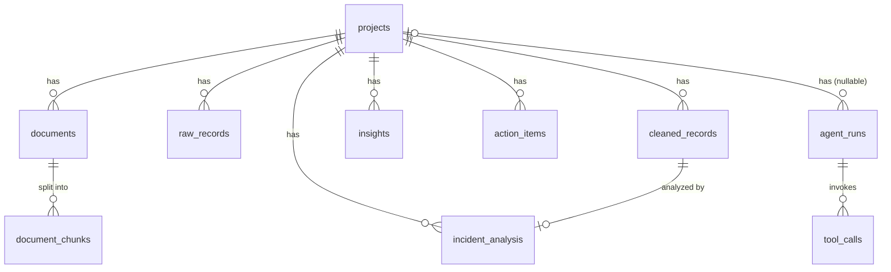

# Data Model — OpsKnowledge Agent Lite

English | [繁體中文](DATA_MODEL.zh-TW.md)

Implementation files:
- ORM models: `backend/app/models/`
- Pydantic schemas: `backend/app/schemas/`
- Initial SQL migration: `backend/migrations/001_initial_schema.sql`
- Table creation script: `backend/scripts/create_tables.py`

---

## Entity Relationship Diagram

---

## Table Reference

### `projects`
A project (tenant-level context). The root node for all data.

| Column | Type | Notes |
|---|---|---|
| id | UUID PK | |
| name | VARCHAR(255) | |
| description | TEXT | nullable |
| created_at | TIMESTAMPTZ | |
| updated_at | TIMESTAMPTZ | |

---

### `documents`
Metadata for uploaded documents such as PDFs.

| Column | Type | Notes |
|---|---|---|
| id | UUID PK | |
| project_id | UUID FK → projects | CASCADE |
| filename | VARCHAR(255) | |
| document_type | VARCHAR(100) | pdf / sop / manual |
| source_path | TEXT | Storage path or URL |
| metadata | JSONB | Page count, language, etc. |
| created_at | TIMESTAMPTZ | |
| updated_at | TIMESTAMPTZ | |

**Indexes:** `project_id`, `created_at`

---

### `document_chunks`
Text chunks produced by splitting a PDF (mapped to PostgreSQL + pgvector).

| Column | Type | Notes |
|---|---|---|
| id | UUID PK | |
| document_id | UUID FK → documents | CASCADE |
| chunk_index | INTEGER | 0-based order |
| content | TEXT | Raw chunk text |
| metadata | JSONB | Page number, section, etc. |
| created_at | TIMESTAMPTZ | |
| updated_at | TIMESTAMPTZ | |

**Indexes:** `document_id`

---

### `raw_records`
Raw incident data before ETL (each CSV/Excel/JSON row stored as-is).

| Column | Type | Notes |
|---|---|---|
| id | UUID PK | |
| project_id | UUID FK → projects | CASCADE |
| source_file | VARCHAR(255) | Original uploaded filename |
| raw_json | JSONB | Raw row data |
| created_at | TIMESTAMPTZ | |
| updated_at | TIMESTAMPTZ | |

**Indexes:** `project_id`, `created_at`

---

### `cleaned_records`
Normalized incident records after ETL.

| Column | Type | Notes |
|---|---|---|
| id | UUID PK | |
| project_id | UUID FK → projects | CASCADE |
| ticket_id | VARCHAR(255) | Source system ticket number |
| occurred_at | TIMESTAMPTZ | nullable |
| system | VARCHAR(255) | Affected system |
| module | VARCHAR(255) | Subsystem / module |
| issue_description | TEXT | |
| resolution | TEXT | nullable |
| status | VARCHAR(100) | open / closed / in_progress |
| priority | VARCHAR(50) | P1–P4 |
| metadata | JSONB | Extra source fields |
| created_at | TIMESTAMPTZ | |
| updated_at | TIMESTAMPTZ | |

**Indexes:** `project_id`, `created_at`, `status`, `priority`

---

### `incident_analysis`
LLM classification and scoring results, 1:1 with `cleaned_records`.

| Column | Type | Notes |
|---|---|---|
| id | UUID PK | |
| project_id | UUID FK → projects | CASCADE |
| record_id | UUID FK → cleaned_records | CASCADE |
| category | VARCHAR(255) | LLM-predicted category |
| severity_score | NUMERIC(5,4) | 0.0000 – 1.0000 |
| sentiment_score | NUMERIC(5,4) | 0.0000 – 1.0000 |
| confidence | NUMERIC(5,4) | 0.0000 – 1.0000 |
| needs_review | BOOLEAN | Low-confidence flag |
| reason | TEXT | LLM explanation |
| created_at | TIMESTAMPTZ | |
| updated_at | TIMESTAMPTZ | |

**Indexes:** `project_id`, `record_id`

---

### `insights`
Project-wide insights generated by the LLM.

| Column | Type | Notes |
|---|---|---|
| id | UUID PK | |
| project_id | UUID FK → projects | CASCADE |
| title | VARCHAR(500) | |
| summary | TEXT | |
| evidence | JSONB | Supporting record IDs / citation list |
| recommendation | TEXT | |
| created_at | TIMESTAMPTZ | |
| updated_at | TIMESTAMPTZ | |

**Indexes:** `project_id`

---

### `action_items`
Action items derived from insights.

| Column | Type | Notes |
|---|---|---|
| id | UUID PK | |
| project_id | UUID FK → projects | CASCADE |
| title | VARCHAR(500) | |
| description | TEXT | |
| priority | VARCHAR(50) | high / medium / low |
| owner_role | VARCHAR(255) | SRE / Network Engineer, etc. |
| status | VARCHAR(100) | pending / in_progress / done |
| created_at | TIMESTAMPTZ | |
| updated_at | TIMESTAMPTZ | |

**Indexes:** `project_id`, `status`

---

### `agent_runs`
Logs of all AI runs (for observability / auditing).

| Column | Type | Notes |
|---|---|---|
| id | UUID PK | |
| project_id | UUID FK → projects | nullable, SET NULL |
| task_type | VARCHAR(255) | classify / score / insight / rag_query |
| model_name | VARCHAR(255) | gpt-4o-mini, etc. |
| input_json | JSONB | Prompt / parameters |
| output_json | JSONB | LLM response |
| status | VARCHAR(50) | running / success / error |
| latency_ms | INTEGER | End-to-end latency |
| error_message | TEXT | nullable |
| created_at | TIMESTAMPTZ | |
| updated_at | TIMESTAMPTZ | |

**Indexes:** `project_id`, `created_at`, `status`

---

### `tool_calls`
Detailed log of each tool call within an agent_run.

| Column | Type | Notes |
|---|---|---|
| id | UUID PK | |
| agent_run_id | UUID FK → agent_runs | CASCADE |
| tool_name | VARCHAR(255) | |
| input_json | JSONB | |
| output_json | JSONB | |
| error_message | TEXT | nullable |
| latency_ms | INTEGER | |
| created_at | TIMESTAMPTZ | |
| updated_at | TIMESTAMPTZ | |

**Indexes:** `agent_run_id`
