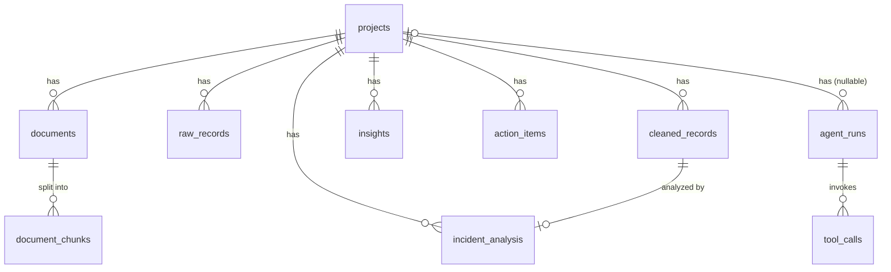

# Data Model — OpsKnowledge Agent Lite

實作檔案：
- ORM 模型：`backend/app/models/`
- Pydantic 結構：`backend/app/schemas/`
- 初始 SQL 遷移：`backend/migrations/001_initial_schema.sql`
- 建立資料表腳本：`backend/scripts/create_tables.py`

---

## 實體關係圖

---

## 資料表說明

### `projects`
專案（租戶層級的情境）。所有資料的根節點。

| Column | Type | Notes |
|---|---|---|
| id | UUID PK | |
| name | VARCHAR(255) | |
| description | TEXT | nullable |
| created_at | TIMESTAMPTZ | |
| updated_at | TIMESTAMPTZ | |

---

### `documents`
上傳的 PDF 等文件 metadata。

| Column | Type | Notes |
|---|---|---|
| id | UUID PK | |
| project_id | UUID FK → projects | CASCADE |
| filename | VARCHAR(255) | |
| document_type | VARCHAR(100) | pdf / sop / manual |
| source_path | TEXT | 儲存路徑或 URL |
| metadata | JSONB | 頁數、語言等 |
| created_at | TIMESTAMPTZ | |
| updated_at | TIMESTAMPTZ | |

**Indexes：** `project_id`、`created_at`

---

### `document_chunks`
PDF 切分後的文字區塊（與 ChromaDB 對應）。

| Column | Type | Notes |
|---|---|---|
| id | UUID PK | |
| document_id | UUID FK → documents | CASCADE |
| chunk_index | INTEGER | 0-based 順序 |
| content | TEXT | 原始區塊文字 |
| metadata | JSONB | 頁碼、章節等 |
| created_at | TIMESTAMPTZ | |
| updated_at | TIMESTAMPTZ | |

**Indexes：** `document_id`

---

### `raw_records`
ETL 前的原始事件資料（CSV/Excel/JSON 的每一列原樣儲存）。

| Column | Type | Notes |
|---|---|---|
| id | UUID PK | |
| project_id | UUID FK → projects | CASCADE |
| source_file | VARCHAR(255) | 上傳的原始檔名 |
| raw_json | JSONB | 原始列資料 |
| created_at | TIMESTAMPTZ | |
| updated_at | TIMESTAMPTZ | |

**Indexes：** `project_id`、`created_at`

---

### `cleaned_records`
ETL 後的正規化事件記錄。

| Column | Type | Notes |
|---|---|---|
| id | UUID PK | |
| project_id | UUID FK → projects | CASCADE |
| ticket_id | VARCHAR(255) | 來源系統票號 |
| occurred_at | TIMESTAMPTZ | nullable |
| system | VARCHAR(255) | 受影響系統 |
| module | VARCHAR(255) | 子系統/模組 |
| issue_description | TEXT | |
| resolution | TEXT | nullable |
| status | VARCHAR(100) | open / closed / in_progress |
| priority | VARCHAR(50) | P1–P4 |
| metadata | JSONB | 來源額外欄位 |
| created_at | TIMESTAMPTZ | |
| updated_at | TIMESTAMPTZ | |

**Indexes：** `project_id`、`created_at`、`status`、`priority`

---

### `incident_analysis`
LLM 分類與評分結果，與 `cleaned_records` 1:1 對應。

| Column | Type | Notes |
|---|---|---|
| id | UUID PK | |
| project_id | UUID FK → projects | CASCADE |
| record_id | UUID FK → cleaned_records | CASCADE |
| category | VARCHAR(255) | LLM 預測類別 |
| severity_score | NUMERIC(5,4) | 0.0000 – 1.0000 |
| sentiment_score | NUMERIC(5,4) | 0.0000 – 1.0000 |
| confidence | NUMERIC(5,4) | 0.0000 – 1.0000 |
| needs_review | BOOLEAN | 低信心度旗標 |
| reason | TEXT | LLM 解釋 |
| created_at | TIMESTAMPTZ | |
| updated_at | TIMESTAMPTZ | |

**Indexes：** `project_id`、`record_id`

---

### `insights`
LLM 針對整個專案產生的洞察。

| Column | Type | Notes |
|---|---|---|
| id | UUID PK | |
| project_id | UUID FK → projects | CASCADE |
| title | VARCHAR(500) | |
| summary | TEXT | |
| evidence | JSONB | 支持記錄 ID / 引文清單 |
| recommendation | TEXT | |
| created_at | TIMESTAMPTZ | |
| updated_at | TIMESTAMPTZ | |

**Indexes：** `project_id`

---

### `action_items`
從洞察衍生的行動項目。

| Column | Type | Notes |
|---|---|---|
| id | UUID PK | |
| project_id | UUID FK → projects | CASCADE |
| title | VARCHAR(500) | |
| description | TEXT | |
| priority | VARCHAR(50) | high / medium / low |
| owner_role | VARCHAR(255) | SRE / Network Engineer 等 |
| status | VARCHAR(100) | pending / in_progress / done |
| created_at | TIMESTAMPTZ | |
| updated_at | TIMESTAMPTZ | |

**Indexes：** `project_id`、`status`

---

### `agent_runs`
所有 AI 執行日誌（可觀測性 / 稽核用）。

| Column | Type | Notes |
|---|---|---|
| id | UUID PK | |
| project_id | UUID FK → projects | nullable，SET NULL |
| task_type | VARCHAR(255) | classify / score / insight / rag_query |
| model_name | VARCHAR(255) | gpt-4o-mini 等 |
| input_json | JSONB | Prompt / 參數 |
| output_json | JSONB | LLM 回應 |
| status | VARCHAR(50) | running / success / error |
| latency_ms | INTEGER | 端對端延遲 |
| error_message | TEXT | nullable |
| created_at | TIMESTAMPTZ | |
| updated_at | TIMESTAMPTZ | |

**Indexes：** `project_id`、`created_at`、`status`

---

### `tool_calls`
agent_runs 內每次工具呼叫的詳細日誌。

| Column | Type | Notes |
|---|---|---|
| id | UUID PK | |
| agent_run_id | UUID FK → agent_runs | CASCADE |
| tool_name | VARCHAR(255) | |
| input_json | JSONB | |
| output_json | JSONB | |
| error_message | TEXT | nullable |
| latency_ms | INTEGER | |
| created_at | TIMESTAMPTZ | |
| updated_at | TIMESTAMPTZ | |

**Indexes：** `agent_run_id`
