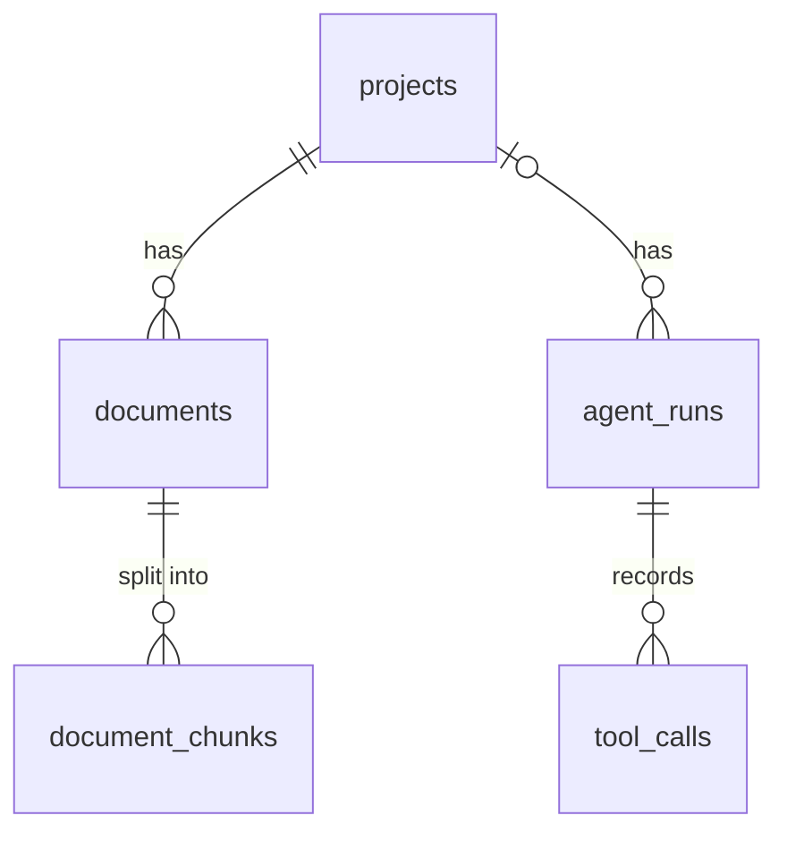

# Data Model — OpsKnowledge Agent Lite

English | [繁體中文](DATA_MODEL.zh-TW.md)

Implementation files:
- ORM models: `backend/app/models/`
- Pydantic schemas: `backend/app/schemas/`
- Initial SQL schema: `backend/migrations/001_initial_schema.sql`
- Table creation script: `backend/scripts/create_tables.py`

---

## Entity Relationship

```mermaid
erDiagram
    projects ||--o{ documents : "has"
    documents ||--o{ document_chunks : "split into"
    projects |o--o{ agent_runs : "has"
    agent_runs ||--o{ tool_calls : "records"
```

---

## Tables

### `projects`

Project-level container for documents and AI run logs.

| Column | Type | Notes |
|---|---|---|
| id | UUID PK | `gen_random_uuid()` |
| name | VARCHAR(255) | Required |
| description | TEXT | Nullable |
| created_at | TIMESTAMPTZ | |
| updated_at | TIMESTAMPTZ | |

---

### `documents`

Uploaded PDF metadata and server-side source path.

| Column | Type | Notes |
|---|---|---|
| id | UUID PK | |
| project_id | UUID FK → projects | CASCADE |
| filename | VARCHAR(255) | Original filename |
| document_type | VARCHAR(100) | Currently `pdf` |
| source_path | TEXT | File path under `data/uploads/` |
| metadata | JSONB | Page count and ingestion metadata |
| created_at | TIMESTAMPTZ | |
| updated_at | TIMESTAMPTZ | |

Indexes: `project_id`, `created_at`

---

### `document_chunks`

Text chunks extracted from uploaded PDFs. This table supports both branches of
hybrid search.

| Column | Type | Notes |
|---|---|---|
| id | UUID PK | |
| document_id | UUID FK → documents | CASCADE |
| chunk_index | INTEGER | Zero-based order within the document |
| content | TEXT | Raw chunk text |
| embedding | vector(1024) | Dense embedding for pgvector retrieval |
| search_vector | TSVECTOR | Generated from `content` for PostgreSQL full-text retrieval |
| metadata | JSONB | Filename, page number, chunk size |
| created_at | TIMESTAMPTZ | |
| updated_at | TIMESTAMPTZ | |

Indexes:
- `document_id`
- HNSW on `embedding` using `vector_cosine_ops`
- GIN on `search_vector`

---

### `agent_runs`

One row per AI interaction. RAG chat writes `task_type="rag_chat"`.

| Column | Type | Notes |
|---|---|---|
| id | UUID PK | |
| project_id | UUID FK → projects | Nullable, SET NULL |
| task_type | VARCHAR(255) | e.g. `rag_chat` |
| model_name | VARCHAR(255) | LLM model or `mock` |
| input_json | JSONB | Request payload summary |
| output_json | JSONB | Answer metadata, usage, timings |
| status | VARCHAR(50) | `success` / `error` |
| latency_ms | INTEGER | End-to-end latency |
| error_message | TEXT | Nullable |
| created_at | TIMESTAMPTZ | |
| updated_at | TIMESTAMPTZ | |

Indexes: `project_id`, `created_at`, `status`

---

### `tool_calls`

Detailed tool-level trace for each agent run.

| Column | Type | Notes |
|---|---|---|
| id | UUID PK | |
| agent_run_id | UUID FK → agent_runs | CASCADE |
| tool_name | VARCHAR(255) | `hybrid_search`, optional `rerank` |
| input_json | JSONB | Tool input |
| output_json | JSONB | Tool output and counts |
| error_message | TEXT | Nullable |
| latency_ms | INTEGER | Tool latency |
| created_at | TIMESTAMPTZ | |
| updated_at | TIMESTAMPTZ | |

Indexes: `agent_run_id`
