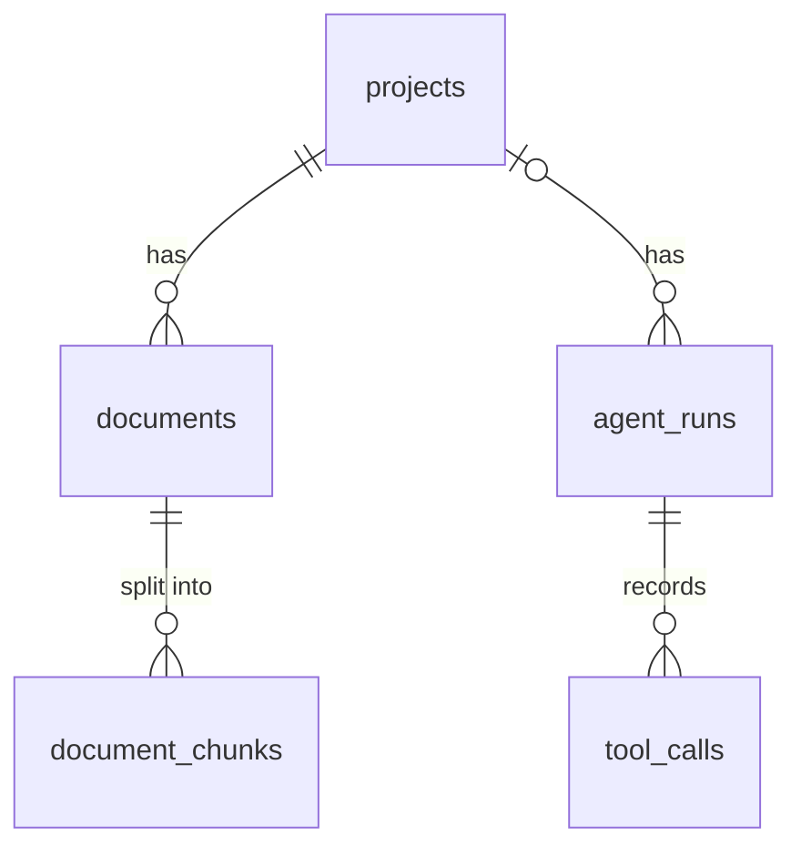

# 資料模型 — OpsKnowledge Agent Lite

[English](DATA_MODEL.md) | 繁體中文

實作檔案：
- ORM 模型：`backend/app/models/`
- Pydantic schemas：`backend/app/schemas/`
- Schema migrations（Alembic，正式來源）：`backend/migrations/versions/`，以 `alembic upgrade head` 套用
- 參考用 SQL schema：`backend/migrations/001_initial_schema.sql`（手動 `psql` 備援）
- Bootstrap 腳本（等同 `alembic upgrade head` 的別名）：`backend/scripts/create_tables.py`

---

## 實體關係

---

## 資料表

### `projects`

專案層級容器，包含文件與 AI 執行紀錄。

| 欄位 | 型別 | 備註 |
|---|---|---|
| id | UUID PK | `gen_random_uuid()` |
| name | VARCHAR(255) | 必填 |
| description | TEXT | nullable |
| created_at | TIMESTAMPTZ | |
| updated_at | TIMESTAMPTZ | |

---

### `documents`

上傳 PDF 的 metadata 與伺服器端檔案路徑。

| 欄位 | 型別 | 備註 |
|---|---|---|
| id | UUID PK | |
| project_id | UUID FK → projects | CASCADE |
| filename | VARCHAR(255) | 原始檔名 |
| document_type | VARCHAR(100) | 目前為 `pdf` |
| source_path | TEXT | `data/uploads/` 底下的檔案路徑 |
| metadata | JSONB | ingestion metadata：`page_count`、`ocr_page_count`（經 OCR 補回文字的頁數） |
| created_at | TIMESTAMPTZ | |
| updated_at | TIMESTAMPTZ | |

索引：`project_id`、`created_at`

---

### `document_chunks`

從 PDF 抽出的文字 chunks。這張表支援 hybrid search 的兩個召回分支。

| 欄位 | 型別 | 備註 |
|---|---|---|
| id | UUID PK | |
| document_id | UUID FK → documents | CASCADE |
| chunk_index | INTEGER | 文件內 zero-based 順序 |
| content | TEXT | 原始 chunk 文字 |
| embedding | vector(1024) | pgvector dense retrieval 用 embedding |
| search_vector | TSVECTOR | 由 `content` 產生，供 PostgreSQL full-text retrieval 使用 |
| metadata | JSONB | 檔名、頁碼、chunk size |
| created_at | TIMESTAMPTZ | |
| updated_at | TIMESTAMPTZ | |

索引：
- `document_id`
- `embedding` HNSW，使用 `vector_cosine_ops`
- `search_vector` GIN

---

### `agent_runs`

每次 AI 互動一筆紀錄。RAG chat（`/chat`）寫入 `task_type="rag_chat"`；自主 agent
（`/agent-chat`）寫入 `task_type="agent_chat"`（其 `output_json` 另含 `search_count`
與 `stop_reason`）。

| 欄位 | 型別 | 備註 |
|---|---|---|
| id | UUID PK | |
| project_id | UUID FK → projects | nullable，SET NULL |
| task_type | VARCHAR(255) | `rag_chat` 或 `agent_chat` |
| model_name | VARCHAR(255) | LLM model 或 `mock` |
| input_json | JSONB | request payload 摘要 |
| output_json | JSONB | answer metadata、usage、timings |
| status | VARCHAR(50) | `success` / `error` |
| latency_ms | INTEGER | 端對端延遲 |
| error_message | TEXT | nullable |
| created_at | TIMESTAMPTZ | |
| updated_at | TIMESTAMPTZ | |

索引：`project_id`、`created_at`、`status`

---

### `tool_calls`

每次 agent run 底下的工具層 trace。

| 欄位 | 型別 | 備註 |
|---|---|---|
| id | UUID PK | |
| agent_run_id | UUID FK → agent_runs | CASCADE |
| tool_name | VARCHAR(255) | `/chat`：`hybrid_search`、選用 `rerank`；`/agent-chat`：`search_documents`；兩者皆可能有選用的 `translate`（跨語 snippet） |
| input_json | JSONB | 工具輸入 |
| output_json | JSONB | 工具輸出與計數 |
| error_message | TEXT | nullable |
| latency_ms | INTEGER | 工具延遲 |
| created_at | TIMESTAMPTZ | |
| updated_at | TIMESTAMPTZ | |

索引：`agent_run_id`
