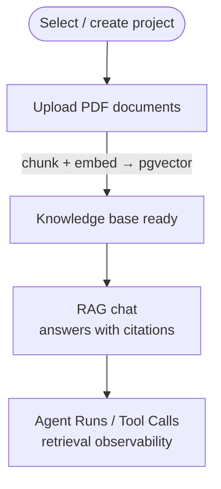

# Product Requirements Document — OpsKnowledge Agent Lite

English | [繁體中文](PRD.zh-TW.md)

## Problem

IT/Operations teams manage large volumes of technical documentation (manuals, SOPs), but:

1. Knowledge is siloed in PDFs — hard to search and query.
2. No AI-assisted Q&A over documents with citation traceability.
3. No auditability for AI decisions — hard to debug or trust outputs.

## Target Users

| User | Role |
|---|---|
| IT Operations Engineer | Uploads SOPs, queries knowledge base via RAG chat |
| (Demo) AI/Data Engineer Interviewer | Evaluates system design and code quality |

## MVP Scope

### Included

- [x] Upload PDF documents → parse → chunk → embed → store in PostgreSQL + pgvector
- [x] Hybrid search / RAG Q&A over documents with citations
- [x] Logging of every AI call to PostgreSQL (model, tokens, latency, result)
- [x] React guided workflow UI: Upload → Confirm → Chat → Inspect
- [x] Docker Compose deployment (PostgreSQL, PostgreSQL + pgvector, backend, frontend)

### Out of Scope (for this POC)

- User authentication / multi-tenant access control
- Real-time streaming of AI responses
- Production-grade vector DB (Pinecone, Weaviate, pgvector)
- Fine-tuning or custom models
- Automated alerting / PagerDuty integration
- Mobile UI

## Success Criteria

1. `/health` endpoint returns `{"status": "ok"}` with DB connected.
2. A PDF can be uploaded, chunked, and queried via semantic search.
3. RAG chat returns answers with citations traceable to source chunks.
4. Every AI invocation is recorded with model name, tokens, and latency.
5. Demo can be walked through end-to-end in under 10 minutes.

## System Architecture & Tech Stack

OpsKnowledge Agent Lite is a containerized full-stack application. A React single-page app calls a FastAPI backend, which persists everything to PostgreSQL (with the pgvector extension for semantic search) and delegates language/embedding work to a pluggable AI provider.

| Layer | Technology |
|---|---|
| Frontend | React 18, TypeScript, Vite, React Router, Tailwind CSS, lucide-react, axios |
| Frontend tests | Vitest, Testing Library, jsdom |
| Backend | FastAPI, Uvicorn, SQLAlchemy, Pydantic / pydantic-settings |
| Backend tests | pytest |
| Database | PostgreSQL 16 + pgvector (`vector(1024)`) |
| LLM / Embeddings | Pluggable provider: `mock` / `ollama` / `openai`; on-prem default = Ollama (`qwen2.5:7b-instruct`) for LLM + mock embeddings (dim 1024) |
| Packaging / Deploy | Docker Compose (postgres, ollama, backend, frontend) |
| Observability | `agent_runs` + `tool_calls` audit logging |

- **Service ports (host → container):** frontend `8501`, backend `8000`, PostgreSQL `5432`, Ollama `11434`.
- **Backend API surface:** `health`, `projects`, `documents`, `uploads`, `chat`, `dashboard` (workflow-status, agent-runs, tool-calls).
- **AI provider model:** `EMBEDDING_PROVIDER` and `LLM_PROVIDER` independently select `mock`, `ollama`, or `openai`. The built-in default is fully offline (`mock`); the shipped `.env.example` uses Ollama for the LLM and mock embeddings for a private, on-prem-style demo.

## System Architecture Diagram

```text
┌───────────────────────────────────────────────────────────────────┐
│ Frontend — React + Vite   (:8501)                                 │
│ Knowledge Workflow | Agent Runs | System Status                   │
└───────────────────────────────────────────────────────────────────┘
                                 │  REST API (Axios, /api proxy)
                                 ▼
┌───────────────────────────────────────────────────────────────────┐
│ Backend — FastAPI   (:8000)                                       │
│ routers : /health /projects /documents /uploads                   │
│           /chat /dashboard                                        │
│ services: document · vector_store · chat · llm                    │
└───────────────────────────────────────────────────────────────────┘
                         │                                        │
                         │ SQLAlchemy                              provider: mock/Ollama/OpenAI
                         ▼                                        ▼
      ┌────────────────────────────────────┐      ┌─────────────────────────────────┐
      │ PostgreSQL 16 + pgvector  (:5432)  │      │ AI Provider (pluggable)         │
      │ vector(1024) search                 │      │ embeddings + completion         │
      │ audit: agent_runs / tool_calls     │      │ mock / Ollama(:11434) / OpenAI  │
      └────────────────────────────────────┘      └─────────────────────────────────┘
```

## User Flow

The product is organized around a single guided, step-based workflow. Each step is positioned automatically from the project's `workflow-status` and the user can return to any earlier available step.

### Knowledge Q&A Workflow


