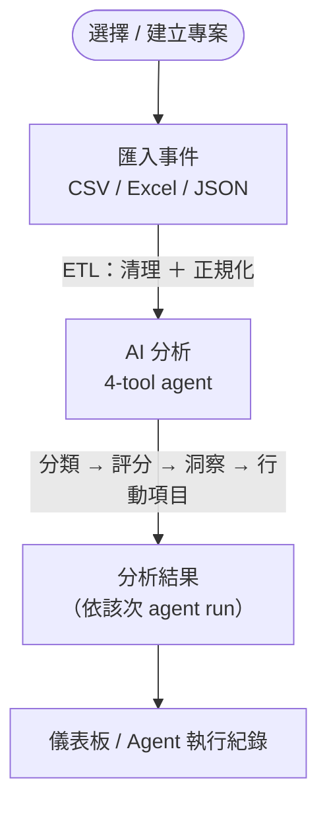
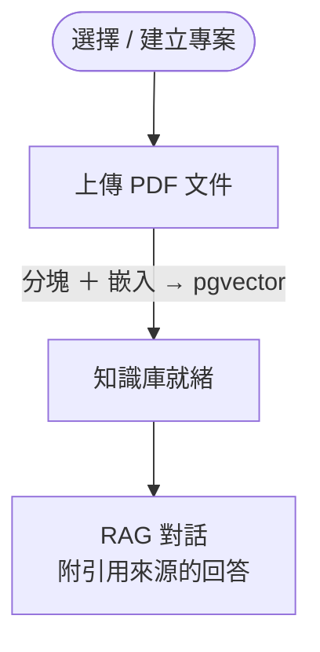

# 產品需求文件 — OpsKnowledge Agent Lite

[English](PRD.md) | 繁體中文

## 問題

IT／維運團隊需管理大量技術文件（手冊、SOP）與事件記錄（工單、維護日誌），但面臨以下困境：

1. 知識被鎖在 PDF 裡 — 難以搜尋與查詢。
2. 事件資料在各系統間不一致 — 格式各異、欄位缺漏。
3. 缺乏 AI 輔助的分流、分類或洞察產生。
4. AI 決策缺乏可稽核性 — 難以除錯或信任其輸出。

## 目標使用者

| 使用者 | 角色 |
|---|---|
| IT 維運工程師 | 上傳 SOP、查詢知識庫、檢視 AI 分析 |
| 系統整合工程師 | 上傳事件 CSV、檢視 ETL 結果與嚴重度評分 |
| 團隊主管 / 經理 | 檢視儀表板摘要與行動項目 |
| （Demo）AI/資料工程面試官 | 評估系統設計與程式碼品質 |

## MVP 範圍

### 包含項目

- [x] 上傳 PDF 文件 → 解析 → 分塊 → 嵌入 → 存入 PostgreSQL + pgvector
- [x] 對文件進行語意搜尋 / RAG 問答
- [x] 上傳 CSV/Excel/JSON 事件記錄 → ETL → PostgreSQL
- [x] AI 對事件類別進行分類
- [x] AI 嚴重度評分（P1–P4）
- [x] AI 洞察產生與行動項目建議
- [x] 將每次 AI 呼叫記錄至 PostgreSQL（模型、tokens、延遲、結果）
- [x] React 儀表板：Upload / Chat / Dashboard / Agent Logs
- [x] Docker Compose 部署（PostgreSQL、PostgreSQL + pgvector、backend、frontend）

### 不在範圍內（此 POC）

- 使用者驗證 / 多租戶存取控制
- AI 回應的即時串流
- 正式等級向量資料庫（Pinecone、Weaviate、pgvector）
- Fine-tuning 或自訂模型
- 自動告警 / PagerDuty 整合
- 行動裝置 UI

## 成功標準

1. `/health` 端點在資料庫連線正常時回傳 `{"status": "ok"}`。
2. PDF 可被上傳、分塊，並透過語意搜尋查詢。
3. 事件 CSV 可被上傳、清洗，並存入 PostgreSQL。
4. AI 能正確分類並評分至少 80% 的範例事件。
5. 每次 AI 呼叫皆記錄模型名稱、tokens 與延遲。
6. Demo 可於 10 分鐘內完成端對端走查。

## 系統架構與技術棧

OpsKnowledge Agent Lite 是一套容器化的全端應用。React 單頁應用呼叫 FastAPI 後端，後端將所有資料持久化至 PostgreSQL（透過 pgvector 擴充支援語意搜尋），並將語言／嵌入運算交由可插拔的 AI provider 處理。

| 層級 | 技術 |
|---|---|
| 前端 | React 18、TypeScript、Vite、React Router、Tailwind CSS、lucide-react、axios |
| 前端測試 | Vitest、Testing Library、jsdom |
| 後端 | FastAPI、Uvicorn、SQLAlchemy、Pydantic / pydantic-settings |
| 後端測試 | pytest |
| 資料庫 | PostgreSQL 16 + pgvector（`vector(384)`） |
| LLM／嵌入 | 可插拔 provider：`mock` / `ollama` / `openai`；地端預設＝Ollama（`qwen2.5:7b-instruct`）作為 LLM ＋ mock 嵌入（維度 384） |
| 封裝／部署 | Docker Compose（postgres、ollama、backend、frontend） |
| 可觀測性 | `agent_runs` ＋ `tool_calls` 稽核紀錄 |

- **服務埠（host → container）：** 前端 `8501`、後端 `8000`、PostgreSQL `5432`、Ollama `11434`。
- **後端 API 範圍：** `health`、`projects`、`documents`、`uploads`、`chat`、`analyze`、`dashboard`。
- **AI provider 模型：** `EMBEDDING_PROVIDER` 與 `LLM_PROVIDER` 可各自獨立選擇 `mock`、`ollama` 或 `openai`。內建預設完全離線（`mock`）；專案附帶的 `.env.example` 則以 Ollama 作 LLM、mock 作嵌入，呈現私有／地端風格的展示。

## 系統架構圖

```text
┌──────────────────────────────────────────────────────────┐
│ 前端 — React + Vite   (:8501)                            │
│ 事件洞察 | 知識庫問答 | 儀表板 | Agent 紀錄 | 系統狀態   │
└──────────────────────────────────────────────────────────┘
                             │  REST API（Axios，/api 代理）
                             ▼
┌──────────────────────────────────────────────────────────┐
│ 後端 — FastAPI   (:8000)                                 │
│ 路由 ： /health /projects /documents /uploads            │
│         /chat /analyze /dashboard                        │
│ 服務 ： document · vector_store · chat · analysis · llm  │
└──────────────────────────────────────────────────────────┘
                         │                                         │
                         │ SQLAlchemy                               provider：mock/Ollama/OpenAI
                         ▼                                         ▼
      ┌─────────────────────────────────────┐      ┌─────────────────────────────────┐
      │ PostgreSQL 16 + pgvector  (:5432)   │      │ AI Provider（可插拔）           │
      │ 10 張資料表 · vector(384) 語意檢索  │      │ 嵌入 + 生成                     │
      │ 稽核：agent_runs / tool_calls       │      │ mock / Ollama(:11434) / OpenAI  │
      └─────────────────────────────────────┘      └─────────────────────────────────┘
```

## 用戶流程

產品以兩個引導式、分步驟的工作流程組織。每個步驟會依專案的 `workflow-status` 自動定位，使用者也可返回任一先前可進入的步驟。

### 事件洞察流程



### 知識庫問答流程


