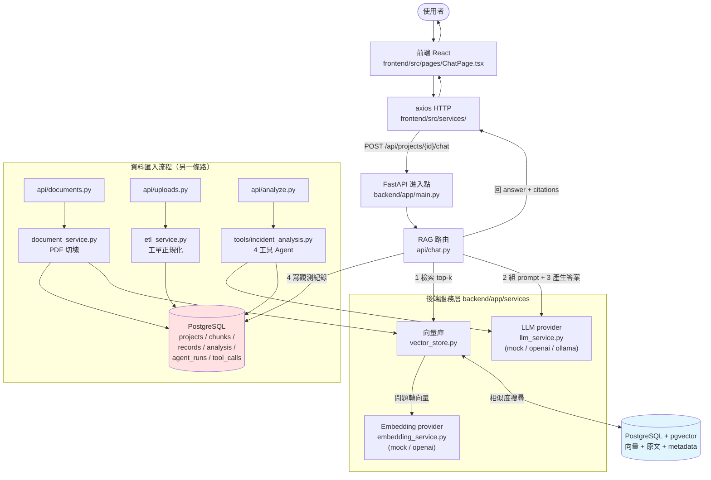

# 系統架構說明（初學者導覽）

> 本文件以初學者能理解的方式說明 **OpsKnowledge Agent Lite** 的整體架構，所有說明皆對應實際檔案路徑。
>
> 相關文件：[`ARCHITECTURE.zh-TW.md`](./ARCHITECTURE.zh-TW.md)（既有架構文件）、[`DATA_MODEL.zh-TW.md`](./DATA_MODEL.zh-TW.md)、[`API.zh-TW.md`](./API.zh-TW.md)

---

## 0. 一句話總覽

這是一個 **IT 維運知識代理 POC**：把「技術文件 PDF」與「事件工單」匯入，提供 **RAG 文件問答** 與 **多工具事件分析 Agent**，並把每次 AI 執行記錄下來供觀測。整個 stack 由 4 個 Docker 服務組成（`docker-compose.yml`）。

四個執行中的服務（`docker-compose.yml:12-99`）：

| 服務 | Port（host → container） | 角色 |
|------|--------------------------|------|
| frontend | 8501 → 8501 | React UI（使用者入口）|
| backend | 8000 → 8000 | FastAPI（`http://localhost:8000/docs`）|
| postgres + pgvector | 5432 → 5432 | PostgreSQL 16 + 向量檢索 |

---

## 1. 專案分成哪些主要模組？

| 模組 | 路徑 | 負責什麼 |
|------|------|---------|
| 前端 (UI) | `frontend/` | React 網頁介面（Vite + TypeScript + Tailwind CSS），使用者操作的地方 |
| 後端 (API) | `backend/app/` | FastAPI 服務，所有商業邏輯 |
| └ API 路由 | `backend/app/api/` | HTTP 端點（對外接口）|
| └ 服務層 | `backend/app/services/` | 核心邏輯：LLM、embedding、向量庫、ETL、文件處理 |
| └ Agent 工具 | `backend/app/tools/` | 事件分析的 4 個工具 |
| └ 資料模型 | `backend/app/models/` | SQLAlchemy ORM（對應 PostgreSQL 資料表）|
| └ 請求/回應格式 | `backend/app/schemas/` | Pydantic schema（API 的輸入輸出形狀）|
| └ 設定/連線 | `backend/app/core/`, `backend/app/db/` | 設定讀取、資料庫連線 |
| 資料庫 schema | `backend/migrations/001_initial_schema.sql` | PostgreSQL 建表 SQL |
| 編排/部署 | `docker-compose.yml`, `Makefile`, `backend/Dockerfile`, `frontend/Dockerfile` | 啟動 4 個服務 |
| 文件 | `docs/`, `README.md` | 架構/API/資料模型說明 |
| 示範資料 | `demo_data/`, `scripts/generate_demo_pdfs.py` | demo 用的工單與 SOP |

---

## 2. 前端在哪裡？

`frontend/` 目錄，用 **React**（Vite + TypeScript + Tailwind CSS）：

- `frontend/src/App.tsx` — 路由進入點，用 React Router v7 定義 7 個頁面路由。
- `frontend/src/pages/` — 各頁面元件：`ProjectPage`、`DocumentsPage`、`ChatPage`、`AnalysisPage`、`DashboardPage`、`AgentRunsPage`、`SystemStatusPage`。
- `frontend/src/services/` — 前端**不直接碰資料庫**，所有動作都透過 axios 用 HTTP 呼叫後端。
- `frontend/src/context/ProjectContext.tsx` — 用 React Context 跨頁面共享當前選取的專案狀態。
- 後端網址由 Vite proxy 設定（`vite.config.js`）轉發 `/api` 路徑，docker 內注入 `BACKEND_URL=http://backend:8000`。

> 初學者理解：前端就是「按鈕和表單」，按下去之後它只是發 HTTP 請求給後端，自己不做運算。

---

## 3. 後端在哪裡？

`backend/app/`，用 **FastAPI**：

- 進入點：`backend/app/main.py` — 建立 FastAPI app，掛上 CORS，並把 7 組路由註冊進來（`main.py:36-42`）。
- 啟動方式（`docker-compose.yml:76`）：先跑 `python scripts/create_tables.py` 建表，再用 `uvicorn app.main:app` 起服務。
- 商業邏輯集中在 `backend/app/services/` 與 `backend/app/tools/`。

---

## 4. API 路由在哪裡？

全部在 `backend/app/api/`，由 `main.py:6-12` 匯入。主要端點：

| 路由檔 | 端點 | 用途 |
|--------|------|------|
| `api/health.py` | `GET /health` | 健康檢查 |
| `api/projects.py` | `GET/POST /projects/` | 建立/列出專案 |
| `api/documents.py` | `POST /projects/{id}/upload/documents`、`GET /projects/{id}/search` | 上傳 PDF、語意搜尋 |
| `api/uploads.py` | `POST /projects/{id}/upload/tickets` | 上傳工單（CSV/Excel/JSON）|
| `api/chat.py` | `POST /projects/{id}/chat` | **RAG 問答** |
| `api/analyze.py` | `POST /projects/{id}/analyze/incidents` | **事件分析 Agent** |
| `api/dashboard.py` | `GET /projects/{id}/dashboard`、agent-runs、tool-calls | 儀表板與觀測資料 |

互動式 API 文件：啟動後在 `http://localhost:8000/docs`。

---

## 5. PostgreSQL 負責存什麼？

PostgreSQL 存**結構化、需要查詢/關聯的資料**。資料表定義在 `backend/migrations/001_initial_schema.sql`，ORM 對應在 `backend/app/models/`：

| 資料表 | 存什麼 |
|--------|--------|
| `projects` | 專案 |
| `documents` | 上傳的 PDF 檔案 metadata 與磁碟路徑 |
| `document_chunks` | PDF 切出來的文字片段（**原文**；它的 `id` 與 PostgreSQL + pgvector 的向量 id 一致，見 `document_service.py:116`）|
| `raw_records` | 工單原始 JSON（ETL 前）|
| `cleaned_records` | ETL 正規化後的工單 |
| `incident_analysis` | 每筆工單的分類/嚴重度/情緒/信心分數 |
| `insights` | 分析產生的洞察 |
| `action_items` | 建議的行動項目 |
| `agent_runs` | **每次 AI 執行的紀錄**（模型、輸入輸出、延遲、狀態）|
| `tool_calls` | 每次執行中各工具的呼叫紀錄 |

> 重點：`document_chunks` 存**文字本身**，PostgreSQL + pgvector 存的是這些文字的**向量**，兩者用同一個 `chunk_id` 對應（`vector_store.py:11-19`）。

---

## 6. PostgreSQL + pgvector 負責存什麼？

PostgreSQL + pgvector 是**向量資料庫**，只負責「語意搜尋」：

- 封裝在 `backend/app/services/vector_store.py`。
- 存的內容（`vector_store.py:49-69` 的 `add_chunks`）：每個 chunk 的**向量（embedding）**、原文、以及 metadata（`project_id`、`document_id`、`chunk_id`、`filename`、`chunk_index`）。
- 用途（`vector_store.py` 的 `search`）：把問題轉成向量，用 pgvector cosine distance 找出最相關的 top-k chunk，並透過 SQL 條件限制只搜尋該專案範圍。
- 連線設定沿用 PostgreSQL 的 `POSTGRES_*`；pgvector 是 PostgreSQL extension，不是獨立服務或 collection。

> 一句話：**PostgreSQL 回答「有哪些資料」，PostgreSQL + pgvector 回答「哪段文字跟這個問題最像」。**

---

## 7. 目前 mock AI 是怎麼運作的？

專案有兩處 AI：**LLM（產生回答）** 與 **Embedding（把文字轉向量）**。兩者都用「provider 模式」，由環境變數切換，預設都是 `mock`（`config.py:45-46`），所以**沒有 API key 也能完整跑端到端**。

### (A) Mock LLM — `backend/app/services/llm_service.py`

- `get_llm_provider()`（`llm_service.py:295-306`）讀 `LLM_PROVIDER`，`"mock"` 就回 `MockLLMProvider`。
- `MockLLMProvider.complete()`（`llm_service.py:152-174`）是**確定性**的、不呼叫任何外部 API：
  - RAG 問答時：若 prompt 沒有 context → 回標準拒答句；若有 context → 從第一個 chunk 擷取前 200 字，加上 `[mock]` 前綴回傳（`llm_service.py:165-173`）。
  - 事件分析時：靠 prompt 裡的 `<<AGENT_TASK:classify/severity/insights/action_items>>` 標記（`llm_service.py:156-163`），用**關鍵字規則**回傳固定 JSON（例如 `_mock_classify` 用關鍵字對應類別，`llm_service.py:184-201`）。

### (B) Mock Embedding — `backend/app/services/embedding_service.py`

- `MockEmbeddingProvider`（`embedding_service.py:50-79`）：把每段文字做 **MD5 hash 當亂數種子**，生成固定的 384 維單位向量。同樣的文字永遠得到同樣的向量，所以搜尋結果可重現。

> 初學者理解：mock 就是「假的 AI」——不花錢、不連網、結果固定，專門用來驗證整條流程（上傳→切塊→搜尋→回答→記錄）是否串得起來。

---

## 8. 未來真正接 AI API 時，最可能要改哪些檔案？

**好消息：幾乎不用改程式碼，主要改設定。** 因為已用 provider 抽象設計好了。

### (A) 最主要——改環境變數（`.env`，範本見 `.env.example`）

切換由這兩個函式讀取：`get_llm_provider()`（`llm_service.py:295`）、`get_embedding_provider()`（`embedding_service.py:82`）。

- `LLM_PROVIDER=openai`（或 `ollama`）、`EMBEDDING_PROVIDER=openai`
- 填 `OPENAI_API_KEY`、`OPENAI_BASE_URL`、`LLM_MODEL`、`EMBEDDING_MODEL`（對應 `config.py:49-53`）
- 若用本地模型：`LLM_PROVIDER=ollama` + `OLLAMA_BASE_URL`/`OLLAMA_MODEL`（`config.py:55-57`）

真正接 API 的類別**已經寫好了**：`OpenAICompatibleLLMProvider`（`llm_service.py:39-79`）、`OllamaLLMProvider`（`llm_service.py:82-139`）、`OpenAIEmbeddingProvider`（`embedding_service.py:23-47`）。

### (B) 只有在這些情況才需要動程式碼

- 想接的廠商**不是 OpenAI 相容、也不是 Ollama**（例如要自訂 Anthropic 原生格式）→ 在 `llm_service.py` 新增一個 `LLMProvider` 子類別，並在 `get_llm_provider()` 加分支。
- 想換 embedding 廠商 → 在 `embedding_service.py` 同理新增子類別。
- 換了 embedding 模型導致**向量維度改變**（目前 pgvector 欄位是 384）→ 同步調整 `EMBEDDING_DIMENSIONS`、`document_chunks.embedding vector(...)` 與既有資料重建策略。

> 結論：正常情況**只改 `.env`**；`config.py` 已有對應欄位；程式入口檔 `chat.py`/`analyze.py` 透過 `get_llm_provider()` 取得 provider，完全不需更動。

---

## 9. 使用者從前端送出問題到看到回答，中間經過哪些檔案？

以「知識庫問答」為例，完整鏈路：

1. `frontend/src/pages/ChatPage.tsx` — 使用者在「知識庫問答」頁輸入問題、按送出，呼叫 chat service。
2. `frontend/src/services/` — 透過 axios 發 `POST /api/projects/{id}/chat` 到後端（Vite proxy 轉發）。
3. `backend/app/main.py:40` — 路由分派到 chat router。
4. `backend/app/api/chat.py:24-97` — 主流程：
   - 查專案是否存在（`chat.py:29`，用 `models/project.py`、`db/session.py`）
   - **Step 1** 向量檢索：`get_vector_store().search()` → `backend/app/services/vector_store.py:71`
   - 向量檢索內部會呼叫 embedding：`embedding_service.py`（mock 或 openai）
   - **Step 2** 組 RAG prompt：`build_rag_prompt()` → `llm_service.py:309`
   - **Step 3** 呼叫 LLM：`get_llm_provider().complete()` → `llm_service.py:295` / `152`（mock）
   - **Step 4** 整理引用：`format_citations()` → `llm_service.py:326`
   - 寫入觀測紀錄 `agent_runs` + `tool_calls`（`chat.py:67-89`，用 `models/agent.py`）
   - 回傳 `ChatResponse`（`schemas/chat.py`）
5. 回到前端 service → `ChatPage.tsx` 顯示答案與引用來源。

涉及檔案總覽：

```
ChatPage.tsx → services/ →（HTTP via Vite proxy）→ main.py → api/chat.py
    → services/vector_store.py + services/embedding_service.py + services/llm_service.py
    → db/session.py + models/*
    → PostgreSQL + pgvector / PostgreSQL → 原路回傳
```

---

## 10. 資料流 Mermaid diagram



---

## 附註（誠實揭露）

- 本文件內容直接從原始碼讀出，未逐行比對既有的 `docs/ARCHITECTURE.zh-TW.md`；兩者定位不同（本文件偏初學者導覽）。
- 撰寫時**未逐行細讀**以下檔案：`api/projects.py`、`api/dashboard.py`、`api/health.py`、`services/etl_service.py`、`tools/incident_analysis.py` 的內文。文中對它們的描述來自路由註冊、import 關係與 docstring。若需要 ETL 或 4 工具的逐行精確邏輯，可再補充，不臆測。
